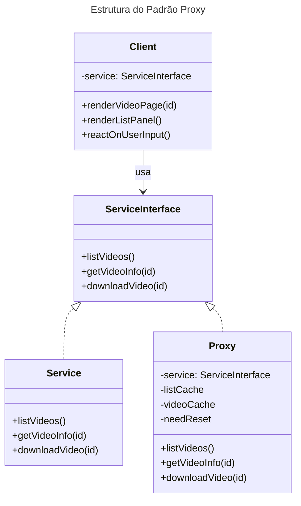

# Padrão Estrutural Proxy

## Intenção
O padrão Proxy tem como objetivo fornecer um substituto ou espaço reservado para outro objeto, controlando o acesso a ele. Em projetos, seu uso permite implementar recursos como inicialização preguiçosa, cache, controle de acesso e outros, sem que o cliente precise alterar seu código para lidar com tais funcionalidades.

## Também conhecido como
Proxy

## Motivação
Em muitos cenários, é necessário gerenciar o acesso a objetos que podem consumir muitos recursos ou que não estão imediatamente disponíveis. Por exemplo, uma biblioteca de integração com o YouTube pode ser muito ineficiente ao baixar vídeos repetidamente. Sem o Proxy, a aplicação poderia realizar downloads múltiplos para o mesmo vídeo, causando sobrecarga e desperdício de recursos. O Proxy resolve esse problema ao implementar uma camada intermediária que realiza a inicialização preguiçosa e mantém um cache dos resultados, de forma que chamadas repetidas retornem o conteúdo armazenado, sem necessidade de novos downloads.

## Aplicabilidade
Utilize o padrão Proxy quando:
- Há necessidade de controle de acesso a um objeto sem alterar sua interface.
- É desejável implementar inicialização preguiçosa para objetos pesados.
- Requer-se a implementação de cache para evitar processamento ou chamadas desnecessárias.
- É preciso proteger o acesso a objetos sensíveis ou remotos.

## Aplicação
Considere um cenário onde uma biblioteca de integração com o YouTube disponibiliza uma classe para download de vídeos, porém com performance insatisfatória. Ao invés de realizar múltiplos downloads para o mesmo vídeo, o padrão Proxy é aplicado para interceptar as chamadas:
- O Proxy implementa a mesma interface da classe real de download.
- Ele mantém um registro dos vídeos já baixados.
- Se o mesmo vídeo for solicitado novamente, o resultado é retornado a partir do cache.
- Assim, o Proxy otimiza o uso de banda e melhora o desempenho da aplicação.

## Estrutura
A estrutura do padrão é composta por:
- **ServiceInterface**: Define a interface do serviço.
- **Service**: Implementação real que contém a lógica de negócio.
- **Proxy**: Atua como intermediário, gerenciando o ciclo de vida do objeto real, realizando inicialização preguiçosa, cache, entre outros.
- **Client**: Utiliza o serviço ou o proxy de forma transparente, pois ambos implementam a mesma interface.

Segue o diagrama UML em mermaid:



## Participantes
1. **ServiceInterface**:  
   - Declara a interface que define os métodos disponíveis para o serviço.  
   - Permite que tanto o objeto real quanto o Proxy sejam intercambiáveis para o cliente.

2. **Service**:  
   - Implementa a lógica de negócio real.  
   - Responsável por executar operações como listagem de vídeos, obtenção de informações e download de vídeos.

3. **Proxy**:  
   - Implementa a mesma interface do serviço real.  
   - Mantém uma referência ao objeto Service e gerencia operações adicionais, como inicialização preguiçosa e cache.  
   - Delegada as chamadas ao objeto Service quando necessário, evitando operações redundantes.

4. **Client**:  
   - Trabalha com objetos que implementam a ServiceInterface, sem se preocupar se está interagindo com o Proxy ou com o Service real.  
   - Recebe o objeto (proxy ou real) e realiza operações como renderizar páginas de vídeo e listas.

## Código Java
A seguir, um exemplo de código Java que implementa o padrão Proxy no cenário de uma integração com o YouTube:

```java
// Interface que declara os métodos do serviço do YouTube.
public interface ThirdPartyYouTubeLib {
    void listVideos();
    void getVideoInfo(String id);
    void downloadVideo(String id);
}

// Implementação real do serviço, simulando chamadas para a API do YouTube.
public class ThirdPartyYouTubeClass implements ThirdPartyYouTubeLib {

    @Override
    public void listVideos() {
        // Simula o envio de um pedido API para o YouTube.
        System.out.println("Listando vídeos do YouTube...");
    }

    @Override
    public void getVideoInfo(String id) {
        // Simula a obtenção de metadados de um vídeo.
        System.out.println("Obtendo informações do vídeo com ID: " + id);
    }

    @Override
    public void downloadVideo(String id) {
        // Simula o download de um vídeo do YouTube.
        System.out.println("Baixando vídeo com ID: " + id);
    }
}

// Classe Proxy que implementa a mesma interface e gerencia o cache e inicialização preguiçosa.
public class CachedYouTubeClass implements ThirdPartyYouTubeLib {
    private ThirdPartyYouTubeLib service;
    private Object listCache;
    private Object videoCache;
    private boolean needReset = false;

    // Construtor que recebe a instância do serviço real.
    public CachedYouTubeClass(ThirdPartyYouTubeLib service) {
        this.service = service;
    }

    @Override
    public void listVideos() {
        // Se não há cache ou se foi solicitado reset, busca a lista no serviço real.
        if (listCache == null || needReset) {
            System.out.println("Cache vazio ou reset solicitado. Obtendo lista de vídeos...");
            service.listVideos();
            // Simula o armazenamento em cache.
            listCache = new Object(); 
        } else {
            System.out.println("Retornando lista de vídeos do cache...");
        }
    }

    @Override
    public void getVideoInfo(String id) {
        // Se o cache de informações não existe ou reset foi solicitado, busca no serviço real.
        if (videoCache == null || needReset) {
            System.out.println("Cache vazio ou reset solicitado. Obtendo informações do vídeo " + id + "...");
            service.getVideoInfo(id);
            // Simula o armazenamento em cache.
            videoCache = new Object();
        } else {
            System.out.println("Retornando informações do vídeo do cache...");
        }
    }

    @Override
    public void downloadVideo(String id) {
        // Verifica se o vídeo já foi baixado; se não, delega o download ao serviço real.
        if (!downloadExists(id) || needReset) {
            System.out.println("Download não encontrado ou reset solicitado. Iniciando download para o vídeo " + id + "...");
            service.downloadVideo(id);
        } else {
            System.out.println("Vídeo já baixado, retornando arquivo em cache...");
        }
    }

    // Método auxiliar para simular a verificação de existência do download.
    private boolean downloadExists(String id) {
        // Nesta simulação, assume que o vídeo não está em cache.
        return false;
    }
}

// Classe que representa o cliente, trabalhando com a interface do serviço.
public class YouTubeManager {
    protected ThirdPartyYouTubeLib service;

    // Recebe um objeto que implementa a interface, podendo ser o serviço real ou o proxy.
    public YouTubeManager(ThirdPartyYouTubeLib service) {
        this.service = service;
    }

    public void renderVideoPage(String id) {
        System.out.println("Renderizando página do vídeo " + id + "...");
        service.getVideoInfo(id);
    }

    public void renderListPanel() {
        System.out.println("Renderizando painel com a lista de vídeos...");
        service.listVideos();
    }

    public void reactOnUserInput(String videoId) {
        renderVideoPage(videoId);
        renderListPanel();
    }
}

// Classe de inicialização da aplicação.
public class Application {
    public static void main(String[] args) {
        // Cria uma instância do serviço real.
        ThirdPartyYouTubeLib youTubeService = new ThirdPartyYouTubeClass();
        // Cria um Proxy que gerencia cache e inicialização preguiçosa.
        ThirdPartyYouTubeLib youTubeProxy = new CachedYouTubeClass(youTubeService);
        // Instancia o gerenciador, utilizando o proxy.
        YouTubeManager manager = new YouTubeManager(youTubeProxy);
        // Simula a interação do usuário.
        manager.reactOnUserInput("12345");
    }
}
```

> **Comentários do código:**
> - **Interface ThirdPartyYouTubeLib:** Define os métodos que serão utilizados tanto pelo serviço real quanto pelo Proxy.
> - **ThirdPartyYouTubeClass:** Simula operações reais, como listar vídeos, obter informações e baixar vídeos.
> - **CachedYouTubeClass (Proxy):** Implementa a mesma interface e adiciona lógica de cache e inicialização preguiçosa. Verifica se os dados já estão disponíveis antes de delegar a chamada ao serviço real.
> - **YouTubeManager:** Cliente que utiliza a interface do serviço sem se preocupar se está interagindo com o serviço real ou com o proxy.
> - **Application:** Demonstra como configurar o Proxy e executar a aplicação.

## Colaborações
O Proxy interage diretamente com o objeto real do serviço, controlando e otimizando o acesso. O cliente trabalha exclusivamente com a interface comum, podendo utilizar o serviço real ou o proxy sem mudanças em seu código. Essa separação permite adicionar funcionalidades (como cache ou controle de acesso) sem modificar o comportamento central do serviço.

## Consequências
**Prós:**
- Permite controle do objeto de serviço sem que os clientes precisem estar cientes.
- Facilita a implementação de inicialização preguiçosa e cache, otimizando o uso de recursos.
- Possibilita a proteção e controle de acesso ao objeto sensível ou remoto.
- Promove o princípio aberto/fechado, permitindo a introdução de novos proxies sem alterar o serviço ou os clientes.

**Contras:**
- Pode aumentar a complexidade do código ao introduzir novas classes.
- A resposta pode sofrer atrasos devido ao processamento adicional do Proxy.
- Exige um gerenciamento cuidadoso do ciclo de vida do objeto de serviço para evitar inconsistências.

## Usos conhecidos
O padrão Proxy é amplamente utilizado em diversos frameworks e sistemas, por exemplo:
- **Hibernate:** Utiliza proxies para implementar carregamento preguiçoso de entidades.
- **Spring Framework:** Emprega proxies para implementar funcionalidades como AOP (Programação Orientada a Aspectos) e controle de transações.
- **APIs Remotas:** Em sistemas distribuídos, proxies são usados para representar serviços remotos e gerenciar chamadas de rede.

## Padrão relacionados
- **Adapter (Estrutural):** Permite que um objeto com uma interface incompatível seja usado por meio de uma interface diferente, ao passo que o Proxy mantém a mesma interface do objeto real.
- **Facade (Estrutural):** Simplifica a interface de um subsistema complexo, mas ao contrário do Proxy, não necessariamente delega chamadas ao objeto real com a mesma interface.
- **Decorator (Estrutural):** Tem estrutura similar ao Proxy, porém seu foco é adicionar responsabilidades ao objeto de forma dinâmica, enquanto o Proxy geralmente gerencia o ciclo de vida do objeto ou controla seu acesso.